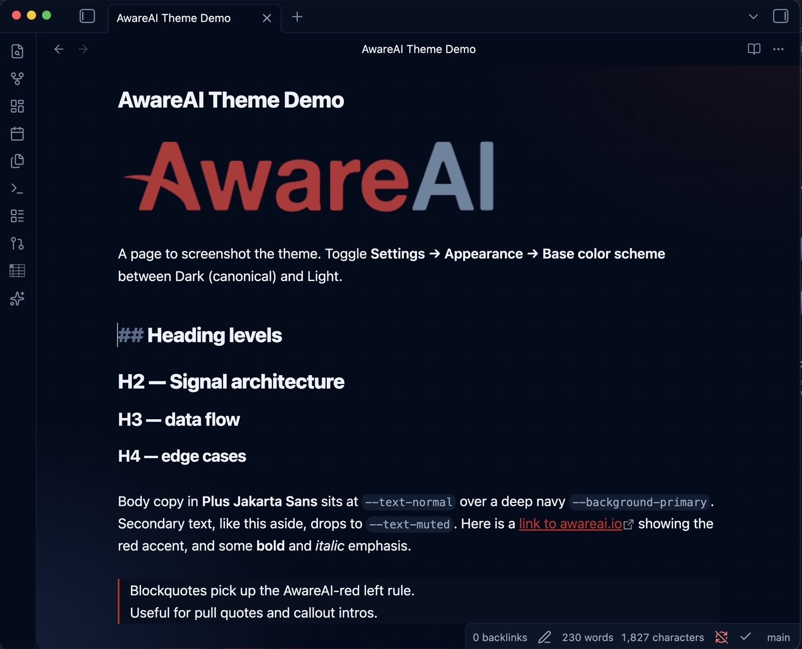

# AwareAI — Obsidian theme

A dark-first Obsidian theme built from the [AwareAI Design System](https://claude.ai/design/p/82f75543-4650-40b1-9530-6ec706c0f34d): deep navy surfaces, an AwareAI-red accent, and the "Signal" accent palette for callouts, tags, and syntax. A light variant keeps the red accent over warm off-white.

## Install (manual)

1. In your vault, create the folder `.obsidian/themes/AwareAI/`.
2. Copy `manifest.json` and `theme.css` into it.
3. In Obsidian: **Settings → Appearance → Themes** → select **AwareAI**.
4. Toggle **Settings → Appearance → Base color scheme** between Dark (canonical) and Light.

## Fonts

The theme uses **Plus Jakarta Sans** (interface + text) and **JetBrains Mono** (code) when they are installed on your system, falling back to system fonts otherwise.

To bundle Plus Jakarta Sans with the theme:

1. Create a `fonts/` folder beside `theme.css`.
2. Drop in the `.ttf` files (`PlusJakartaSans-Regular.ttf`, `-Medium`, `-SemiBold`, `-Bold`, `-ExtraBold`).
3. Uncomment the `@font-face` block at the top of `theme.css`.

## Token mapping

| AwareAI token | Obsidian role |
|---|---|
| `--bg` `#020C1B` | `--background-primary` (dark) |
| `--surface` `#0A1628` | `--background-secondary` |
| `--border` `#162342` | `--background-modifier-border` |
| `--fg-secondary` `#94AABF` | `--text-muted` |
| `--fg-primary` `#EEF2FF` | `--text-normal` |
| `--aware-red` `#C4261F` | `--interactive-accent` / `--text-accent` |
| Signal green/blue/purple/yellow/red | `--color-green` / `-blue` / `-purple` / `-yellow` / `-red` |
